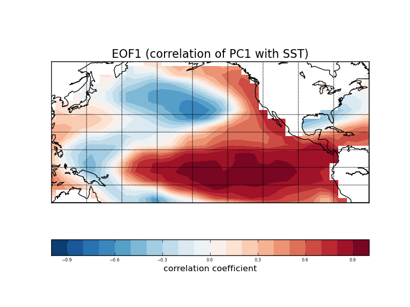
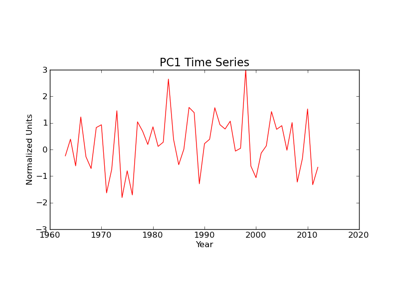

Practical Example: Sea Surface Temperature (ENSO)
=================================================

This example applies EOF analysis to wintertime Pacific sea surface temperature (SST) anomalies. The leading mode of variability in the Pacific in wintertime is El |Nino|, so our leading EOF should show the spatial signature of El |Nino|, and our leading PC time series should show variability on typical El |Nino| time-scales.

Getting The Example Data
------------------------

The data for this example are SST anomalies obtained from the `Kaplan SST <http://www.esrl.noaa.gov/psd/data/gridded/>`_ data set. The following Python code can be used to download the data (~9 MB) in NetCDF format:

.. code-block:: python

   import os
   import urllib2

   sst_remote = "http://www.esrl.noaa.gov/psd/thredds/fileServer/Datasets/kaplan_sst/sst.mon.anom.nc"
   sst_local = "sst.mon.mean.nc"
   ncremote = urllib2.urlopen(sst_remote)
   nclocal = open(sst_local, "wb")
   nclocal.write(ncremote.read())
   nclocal.close()
   ncremote.close()

Reading And Preparing The Example Data
--------------------------------------

In this example we'll analyse November-March (NDJFM) means of SST anomaly. We first read in SST, then extract NDJFM seasonal means. This is done using the :py:mod:`cdms2` and :py:mod:`cdutil` packages from CDAT:

.. code-block:: python

   import cdms2
   import cdutil

   # Read the SST data from the file we downloaded previously.
   ncin = cdms2.open(sst_local, "r")
   sst = ncin("sst")
   ncin.close()

   # Tell cdutil that this is a monthly data set, and construct NDJFM
   # means.
   cdutil.setTimeBoundsMonthly(sst)
   NDJFM = cdutil.times.Seasons("NDJFM")
   sst_djf = NDJFM(sst)

The EOF Analysis
----------------

In this example we'll compute the leading EOF of SST in the tropical and North Pacific. This region is defined here as 120E-60W, 20S-60N. We also retrieve the corrsponding PC time series scaled to unit variance:

.. code-block:: python
   
   from eof2 import Eof

   # Select the Central and North Pacific region.
   sst_djf_cp = sst_djf(latitude=(-20,60,"ccb"), longitude=(120,300,"ccb"))

   # Create and Eof solver. Square-root of cosine of latitude weights are
   # applied to the data to account for the convergence of meridians.
   solver = Eof(sst_djf_cp, weights="coslat", center=True)

   # Retrieve the leading EOF expressed as the correlation between the
   # leading PC and the SST anaomaly data at every grid point.
   eof1 = solver.eofsAsCorrelation(neofs=1)

   # Retrieve the corresponding PC time series. Use scaling option '1' to
   # give the returned PCs unit variance.
   pc1 = solver.pcs(npcs=1, pcscaling=1)

Visualizing The Results
-----------------------

Now we'll use the :py:mod:`matplotlib` package along with the :py:mod:`mpl_toolkits.basemap` toolkit to plot the spatial pattern of leading EOF and a subset of the leading PC time series:

.. code-block:: python

   import matplotlib.pyplot as plt
   from mpl_toolkits.basemap import Basemap

   import numpy as np

   # Create a Basemap object to handle map projections. Use this to transform
   # geophysical coordinates to map projection coordinates.
   m = Basemap(projection="cyl", llcrnrlon=120, llcrnrlat=-20,
           urcrnrlon=300, urcrnrlat=60)
   lons, lats = eof1.getLongitude()[:], eof1.getLatitude()[:]
   x, y = m(*np.meshgrid(lons, lats))

   # Plot a filled contour map of the leading EOF.
   clevs = np.arange(-1, 1.1, .1)
   m.contourf(x, y, eof1(squeeze=True), clevs, cmap=plt.cm.RdBu)
   m.drawcoastlines()
   m.drawparallels(np.arange(-30,31,10))
   m.drawmeridians(np.arange(120,310,20))
   cb = plt.colorbar(orientation="horizontal")
   cb.set_label("correlation coefficient", fontsize=12)
   plt.title("EOF1 (correlation of PC1 with SST)", fontsize=16)

   # Plot a line graph of the last 50 years of the PC time series.
   plt.figure(figsize=(8,4))
   time = [c.year for c in sst_djf_cp.getTime().asComponentTime()]
   plt.plot(time[-50:], pc1[-50:], color='r', linestyle='-')
   plt.title('PC1 Time Series', fontsize=16)
   plt.xlabel('Year', fontsize=12)
   plt.ylabel('Normalized Units', fontsize=12)
   plt.ylim(-3, 3)
   for l in plt.gca().get_xticklabels() + plt.gca().get_yticklabels():
       l.set_fontsize(12)

   plt.show()

The plots output by this code are shown below. The spatial pattern of EOF1 is the canonical El |Nino| pattern, with warm anomalies in the equatorial East Pacific and a horseshoe of cold anomaly surrounding it. The PC1 time series shows variability on the typical El |Nino| time-scales of around 4-7 years, with notable peaks for the 1982/83 and 1997/98 El |Nino| events.

.. |Nino| unicode:: Ni U+00F1 o

